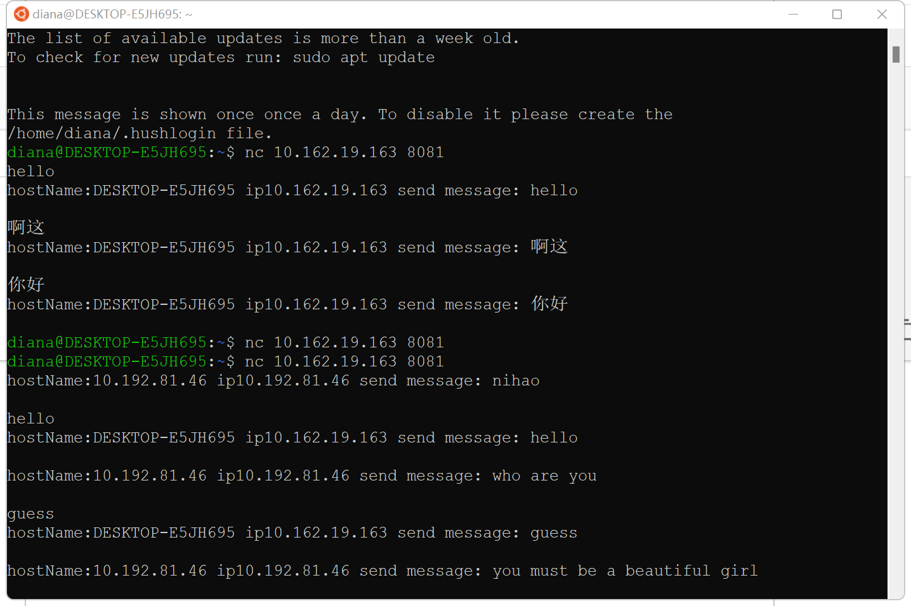

# Multi-clientChatServer

*project for Java*

### 01. Subject requirements

Realize a multi-client plain text chat server that can accept connections from multiple clients at the same time, and forward the text sent by any one client to all clients (including the sender). submit:

1. Source code;
2. Executable jar;
3. Experiment report.

### 02. Code Framework

+ class `server`
   + Start a thread and see that there is a message in the `msg` queue, and then traverse the `lstClient` queue to send a message
+ class `client`
   + Start a thread to receive messages
   + When the message is received, it is placed in the `msg` queue of the server

###  04. RESULT

+ vscode terminal

+ addr = /10.162.19.163

+ addr = /10.192.81.46

